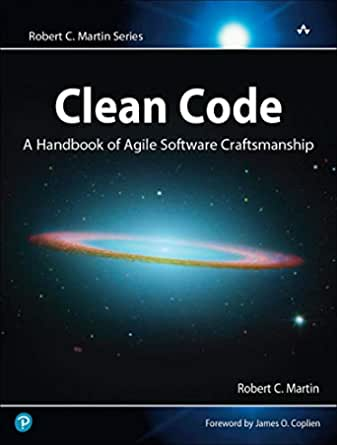
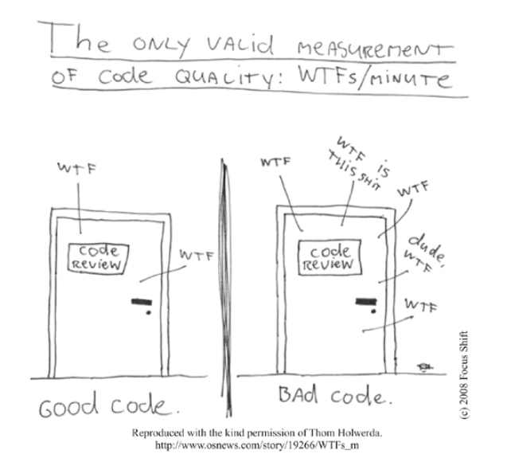

<!-- START doctoc generated TOC please keep comment here to allow auto update -->
<!-- DON'T EDIT THIS SECTION, INSTEAD RE-RUN doctoc TO UPDATE -->
**Table of Contents**  *generated with [DocToc](https://github.com/thlorenz/doctoc)*

- [Clean Code Summary](#clean-code-summary)
  - [Cover](#cover)
  - [Foreword](#foreword)
  - [Introduction](#introduction)
  - [Acknowledgments](#acknowledgments)
  - [Chapter 1: Clean Code](#chapter-1-clean-code)
  - [Chapter 2: Meaningful Names](#chapter-2-meaningful-names)
  - [Chapter 3: Functions](#chapter-3-functions)
  - [Chapter 4: Comments](#chapter-4-comments)
  - [Chapter 5: Formatting](#chapter-5-formatting)
  - [Chapter 6: Objects and Data Structures](#chapter-6-objects-and-data-structures)
  - [Chapter 7: Error Handling](#chapter-7-error-handling)
  - [Chapter 8: Boundaries](#chapter-8-boundaries)
  - [Chapter 9: Unit Tests](#chapter-9-unit-tests)
  - [Chapter 10: Classes](#chapter-10-classes)
  - [Chapter 11: Systems](#chapter-11-systems)
  - [Chapter 12: Emergence](#chapter-12-emergence)
  - [Chapter 13: Concurrency](#chapter-13-concurrency)
  - [Chapter 14: Successive Refinement](#chapter-14-successive-refinement)
  - [Chapter 15: JUnit Internals](#chapter-15-junit-internals)
  - [Chapter 16: Refactoring SerialDate](#chapter-16-refactoring-serialdate)
  - [Chapter 17: Smells and Heuristics](#chapter-17-smells-and-heuristics)
  - [Appendix A: Concurrency II](#appendix-a-concurrency-ii)
  - [Appendix B: org.jfree.date.SerialDate](#appendix-b-orgjfreedateserialdate)
  - [Appendix C: Cross References of Heuristics](#appendix-c-cross-references-of-heuristics)
  - [Epilogue](#epilogue)
  - [Index](#index)

<!-- END doctoc generated TOC please keep comment here to allow auto update -->

# Clean Code Summary

## Cover

  

 God is in the details. 
 
Luwig mies van der Rohe

<!-- ////////////////////////////////////////////////////////  -->
<!-- ////////////////////////////////////////////////////////  -->
<!-- ////////////////////////////////////////////////////////  -->

## Foreword

5S principles:
- Organization (sort): Knowing where things are is crucial.
- Tidiness (systematize). A place for everything, and everything in its place.
- Cleaning (shine): keep the workplace free of hanging wires, grease, scraps, and waste.
- Standardization:
- Discipline(self-discipline).

Making your code readable is as important as making it executable.

Cleanliness is next to godliness.

<!-- ////////////////////////////////////////////////////////  -->
<!-- ////////////////////////////////////////////////////////  -->
<!-- ////////////////////////////////////////////////////////  -->

## Introduction

  

## Acknowledgments
TODO

## Chapter 1: Clean Code
[Go to ...](./chapters/chapter_1_clean_code/README.md)

## Chapter 2: Meaningful Names
[Go to ...](./chapters/chapter_2_meaningful_names/README.md)

## Chapter 3: Functions
[Go to ...](./chapters/chapter_3_functions/README.md)

## Chapter 4: Comments
[Go to ...](./chapters/chapter_4_comments/README.md)

## Chapter 5: Formatting
[Go to ...](./chapters/chapter_5_formattings/README.md)

## Chapter 6: Objects and Data Structures
[Go to ...](./chapters/chapter_6_objects_and_data_structures/README.md)

## Chapter 7: Error Handling
[Go to ...](./chapters/chapter_7_error_handling/README.md)

## Chapter 8: Boundaries
[Go to ...](./chapters/chapter_8_boundaries/README.md)

## Chapter 9: Unit Tests
[Go to ...](./chapters/chapter_9_unit_tests/README.md)

## Chapter 10: Classes
[Go to ...](./chapters/chapter_10_classes/README.md)

## Chapter 11: Systems
[Go to ...](./chapters/chapter_11_systems/README.md)

## Chapter 12: Emergence
[Go to ...](./chapters/chapter_12_emergence/README.md)

## Chapter 13: Concurrency
[Go to ...](./chapters/chapter_13_concurrency/README.md)

## Chapter 14: Successive Refinement
[Go to ...](./chapters/chapter_14_successive_refinement/README.md)

## Chapter 15: JUnit Internals
[Go to ...](./chapters/chapter_15_junit_internals/README.md)

## Chapter 16: Refactoring SerialDate
[Go to ...](./chapters/chapter_16_refactoring_serialdate/README.md)

## Chapter 17: Smells and Heuristics
[Go to ...](./chapters/chapter_17_smells_and_heuristics/README.md)

## Appendix A: Concurrency II
TODO
## Appendix B: org.jfree.date.SerialDate

TODO
## Appendix C: Cross References of Heuristics
TODO
## Epilogue
TODO
## Index
TODO